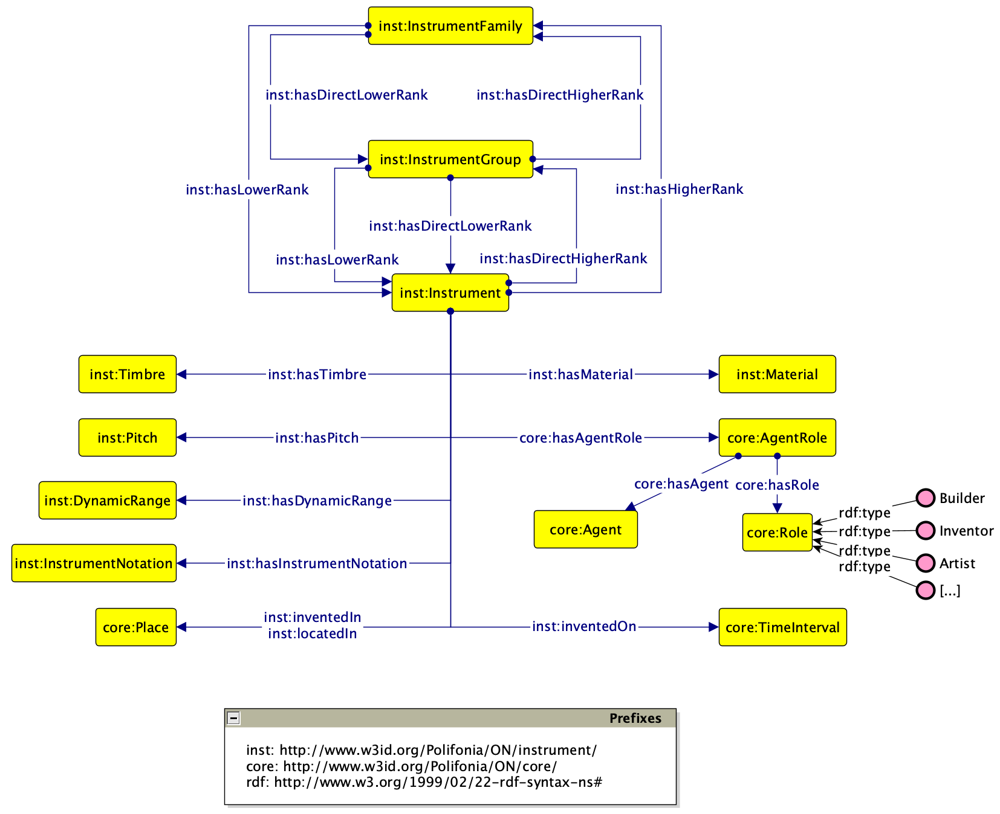

# Instrument ontology
The Instrument ontology module represents musical instruments as mediums of performance and their technical properties.

[](https://zenodo.org/badge/latestdoi/372536364)
[](https://creativecommons.org/licenses/by/4.0/)



---

## Competency questions addressed
- Which is the physical realization of an instrument?
- Which are the parts of an instrument?
- Who invented an instrument?
- When was an instrument invented?
- Where was an instrument realization built?
- When was an instrument realization built?
- Who built an instrument realization?
- Which is the current location of an instrument realization?
- Which are the locations of an instrument realization during its life cycle?
- 

## Competency questions planned


## Examples of SPARQL queries
- Which is the physical realization of an instrument?
```
PREFIX inst: <https://w3id.org/polifonia/ontology/instrument/>
PREFIX core: <https://w3id.org/polifonia/ontology/core/>
SELECT DISTINCT ?instrument ?instrumentRealization
WHERE { ?instrument core:isRealizedBy ?instrumentRealization .
}
```

## Related ontologies

### External imports
- [ArCo Location Ontology module](https://w3id.org/arco/ontology/location)

### Aligned ontologies
- [Wikidata](link)

## Statistics
Considering that this module imports other modules of the network and the ArCo ontology, relevant statistics are: 
- number of classes: 161 
- number of object properties: 209
- number of datatype properties: 41
- number of logical axioms: 876

## Datasets


## License

This work is licensed under a
[Creative Commons Attribution 4.0 International License][cc-by].


[cc-by]: http://creativecommons.org/licenses/by/4.0/
